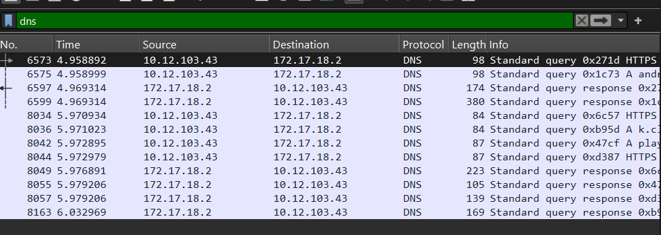
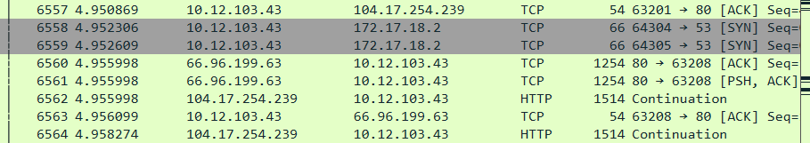
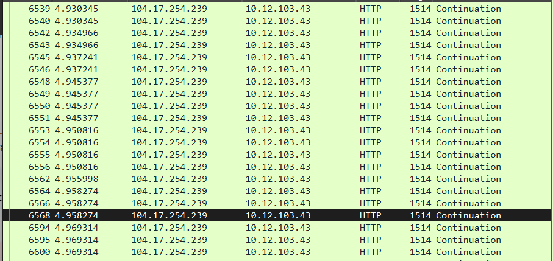

# 📡 Network Packet Analysis (DNS, TCP, HTTP)

This repository contains a basic packet analysis of network traffic using Wireshark. The analysis focuses on DNS, TCP, and HTTP traffic observed between different hosts during a simulated web access session.

---

## 📂 Contents

- Packet capture screenshots
- Protocol analysis (DNS, TCP handshake, HTTP stream)
- Observations on request-response patterns
- Wireshark used as the packet analyzer

---

## 🖼️ DNS Packet Capture



### 🔍 Observations
- Host `10.12.103.43` is querying DNS server `172.17.18.2` for domain name resolutions.
- Multiple queries observed including A and AAAA types.
- Responses were received from the DNS server with valid entries.
- Lengths range from 84 to 380 bytes indicating varied query complexity.

---

## 🖼️ TCP Packet Capture



### 🔍 Observations
- Standard TCP three-way handshakes were captured:
  - SYN from client → SYN-ACK from server → ACK from client.
- Ports 53 (DNS) and 80 (HTTP) are involved, showing TCP transport for DNS and HTTP protocols.
- Some retransmissions and PSH-ACK combinations indicate active HTTP data transfers.

---

## 🖼️ HTTP Packet Capture



### 🔍 Observations
- HTTP continuation packets (1514 bytes) exchanged between `10.12.103.43` and `104.17.254.239`.
- Suggests the fetching of a large web object or persistent HTTP connection.
- No TLS encryption — communication is in plain HTTP (likely HTTP/1.1).

---

## 🔧 Tools Used

- **Wireshark** (for packet capturing and filtering using `dns`, `tcp`, and `http` display filters)
- **GitHub** (for version control and submission)
- **Markdown** (for documentation)

---

## ✅ Task Summary

- Captured and filtered DNS, TCP, and HTTP packets using Wireshark.
- Analyzed request-response behavior between internal and external IPs.
- Documented the process visually and analytically.

---

## 📎 Repository Structure

```
network-packet-analysis/
│
├── captures/
│   ├── dns_packets.png
│   ├── tcp_packets.png
│   ├── http_packets.png
│
├── README.md
```

---

## 👤 Author

- Name: *[Your Name Here]*
- Course: *[Course or Assignment Name]*
- Institution: *[Your College/University Name]*